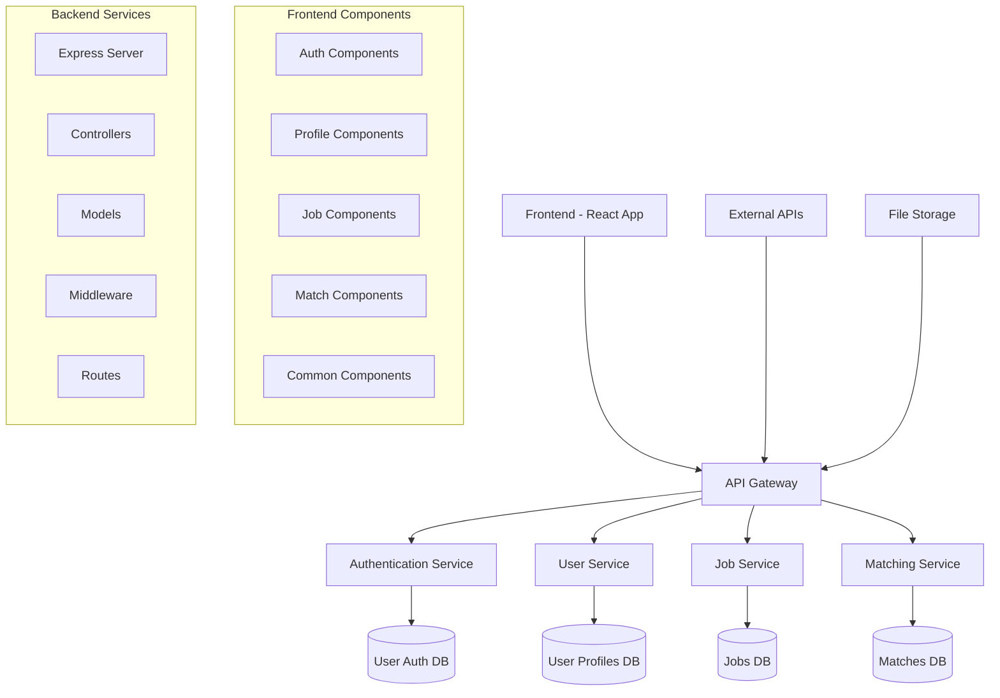

# JINDER - Project Overview

*Internal Development Documentation*

## Table of Contents
1. [Project Structure](#project-structure)
2. [Current Progress Status](#current-progress-status)
3. [Component Architecture](#component-architecture)
4. [API Endpoints](#api-endpoints)
5. [Database Schema](#database-schema)
6. [Development Workflow](#development-workflow)
7. [Next Steps](#next-steps)

---

## Project Structure

```
jinder/
├── frontend/
│   ├── public/
│   │   ├── index.html
│   │   └── manifest.json
│   ├── src/
│   │   ├── components/
│   │   │   ├── common/
│   │   │   ├── onboarding/
│   │   │   ├── matching/
│   │   │   └── profile/
│   │   ├── services/
│   │   │   ├── api.js
│   │   │   └── auth.js
│   │   ├── utils/
│   │   ├── styles/
│   │   ├── App.js
│   │   └── index.js
│   ├── package.json
│   └── README.md
├── backend/
│   ├── src/
│   │   ├── controllers/
│   │   │   ├── authController.js
│   │   │   ├── userController.js
│   │   │   ├── matchController.js
│   │   │   └── jobController.js
│   │   ├── models/
│   │   │   ├── User.js
│   │   │   ├── Job.js
│   │   │   ├── Match.js
│   │   │   └── Company.js
│   │   ├── routes/
│   │   │   ├── auth.js
│   │   │   ├── users.js
│   │   │   ├── jobs.js
│   │   │   └── matches.js
│   │   ├── middleware/
│   │   │   ├── auth.js
│   │   │   ├── validation.js
│   │   │   └── errorHandler.js
│   │   ├── config/
│   │   │   ├── database.js
│   │   │   └── config.js
│   │   ├── utils/
│   │   └── server.js
│   ├── package.json
│   └── README.md
├── docs/
│   ├── api-documentation.md
│   ├── deployment-guide.md
│   └── project-overview.md
├── tests/
├── .github/
│   └── workflows/
├── .gitignore
└── README.md
```

## Current Progress Status

### ✅ Completed Features
- Basic project structure setup
- Frontend React application initialization
- Backend Express.js server setup
- User authentication system (JWT-based)
- Database models design
- Basic API endpoints structure
- User registration and login functionality
- Profile management system

### 🚧 In Progress
- Job posting and management system
- Matching algorithm implementation
- Frontend UI/UX components
- API integration between frontend and backend
- User onboarding flow

### 📋 Planned Features
- Real-time messaging system
- Advanced matching algorithms
- Company dashboard
- Analytics and reporting
- Mobile responsiveness optimization
- Notification system
- Search and filtering capabilities

## Component Architecture



### Key Components

#### Frontend Components
- **Auth Components**: Login, Register, Password Reset
- **Profile Components**: Profile creation, editing, viewing
- **Job Components**: Job listings, job details, job posting
- **Match Components**: Swipe interface, match results, conversations
- **Common Components**: Headers, footers, loading states, modals

#### Backend Services
- **Authentication Service**: JWT token management, user verification
- **User Service**: Profile CRUD operations, user preferences
- **Job Service**: Job posting, retrieval, and management
- **Matching Service**: Algorithm processing, match generation

## API Endpoints

### Authentication Endpoints
```
POST   /api/auth/register     - User registration
POST   /api/auth/login        - User login
POST   /api/auth/logout       - User logout
POST   /api/auth/refresh      - Refresh JWT token
POST   /api/auth/forgot       - Password reset request
POST   /api/auth/reset        - Password reset confirmation
```

### User Endpoints
```
GET    /api/users/profile     - Get current user profile
PUT    /api/users/profile     - Update user profile
DELETE /api/users/profile     - Delete user account
POST   /api/users/upload      - Upload profile pictures
GET    /api/users/:id         - Get user by ID (admin)
```

### Job Endpoints
```
GET    /api/jobs              - Get job listings (with filters)
GET    /api/jobs/:id          - Get specific job details
POST   /api/jobs              - Create new job posting (company)
PUT    /api/jobs/:id          - Update job posting (company)
DELETE /api/jobs/:id          - Delete job posting (company)
GET    /api/jobs/my-posts     - Get company's job postings
```

### Matching Endpoints
```
GET    /api/matches/candidates - Get potential matches for user
POST   /api/matches/swipe      - Record swipe action (like/pass)
GET    /api/matches/mutual     - Get mutual matches
GET    /api/matches/history    - Get user's swipe history
DELETE /api/matches/:id       - Remove match
```

### Company Endpoints
```
POST   /api/companies/register - Company registration
GET    /api/companies/profile  - Get company profile
PUT    /api/companies/profile  - Update company profile
GET    /api/companies/:id      - Get company details
```

## Database Schema

### Users Table
```sql
CREATE TABLE users (
    id UUID PRIMARY KEY DEFAULT gen_random_uuid(),
    email VARCHAR(255) UNIQUE NOT NULL,
    password_hash VARCHAR(255) NOT NULL,
    first_name VARCHAR(100) NOT NULL,
    last_name VARCHAR(100) NOT NULL,
    phone VARCHAR(20),
    date_of_birth DATE,
    location JSON, -- {city, state, country, coordinates}
    bio TEXT,
    skills JSON, -- Array of skills
    experience_level ENUM('entry', 'mid', 'senior', 'executive'),
    education JSON, -- Array of education objects
    work_experience JSON, -- Array of work experience objects
    preferences JSON, -- Job preferences, salary range, etc.
    profile_pictures JSON, -- Array of image URLs
    is_active BOOLEAN DEFAULT true,
    is_verified BOOLEAN DEFAULT false,
    user_type ENUM('candidate', 'company', 'admin') DEFAULT 'candidate',
    created_at TIMESTAMP DEFAULT CURRENT_TIMESTAMP,
    updated_at TIMESTAMP DEFAULT CURRENT_TIMESTAMP
);
```

### Jobs Table
```sql
CREATE TABLE jobs (
    id UUID PRIMARY KEY DEFAULT gen_random_uuid(),
    company_id UUID REFERENCES users(id),
    title VARCHAR(200) NOT NULL,
    description TEXT NOT NULL,
    requirements JSON, -- Array of requirements
    skills_required JSON, -- Array of required skills
    location JSON, -- Job location details
    salary_range JSON, -- {min, max, currency, period}
    employment_type ENUM('full-time', 'part-time', 'contract', 'internship'),
    experience_level ENUM('entry', 'mid', 'senior', 'executive'),
    benefits JSON, -- Array of benefits
    application_deadline DATE,
    is_active BOOLEAN DEFAULT true,
    views_count INTEGER DEFAULT 0,
    applications_count INTEGER DEFAULT 0,
    created_at TIMESTAMP DEFAULT CURRENT_TIMESTAMP,
    updated_at TIMESTAMP DEFAULT CURRENT_TIMESTAMP
);
```

### Matches Table
```sql
CREATE TABLE matches (
    id UUID PRIMARY KEY DEFAULT gen_random_uuid(),
    user_id UUID REFERENCES users(id),
    job_id UUID REFERENCES jobs(id),
    swipe_action ENUM('like', 'pass', 'super_like'),
    is_mutual BOOLEAN DEFAULT false,
    match_score DECIMAL(3,2), -- Algorithm-generated match score
    created_at TIMESTAMP DEFAULT CURRENT_TIMESTAMP
);
```

### Companies Table
```sql
CREATE TABLE companies (
    id UUID PRIMARY KEY DEFAULT gen_random_uuid(),
    user_id UUID REFERENCES users(id),
    company_name VARCHAR(200) NOT NULL,
    industry VARCHAR(100),
    size ENUM('startup', 'small', 'medium', 'large', 'enterprise'),
    founded_year INTEGER,
    website VARCHAR(255),
    linkedin_url VARCHAR(255),
    logo_url VARCHAR(255),
    description TEXT,
    culture JSON, -- Company culture attributes
    benefits JSON, -- Standard company benefits
    locations JSON, -- Array of office locations
    is_verified BOOLEAN DEFAULT false,
    created_at TIMESTAMP DEFAULT CURRENT_TIMESTAMP,
    updated_at TIMESTAMP DEFAULT CURRENT_TIMESTAMP
);
```

## Development Workflow

### Git Workflow
1. **Main Branch**: `main` - Production-ready code
2. **Development Branch**: `develop` - Integration branch
3. **Feature Branches**: `feature/feature-name` - Individual features
4. **Hotfix Branches**: `hotfix/issue-description` - Critical fixes

### Branch Naming Convention
- `feature/user-authentication`
- `feature/job-matching-algorithm`
- `bugfix/login-validation-error`
- `hotfix/security-vulnerability`

### Commit Message Format
```
type(scope): description

[optional body]

[optional footer]
```

Types: `feat`, `fix`, `docs`, `style`, `refactor`, `test`, `chore`

Examples:
- `feat(auth): add JWT token refresh functionality`
- `fix(matching): resolve algorithm scoring bug`
- `docs(api): update endpoint documentation`

### Development Environment Setup
1. Clone repository
2. Install dependencies: `npm install` (both frontend and backend)
3. Set up environment variables
4. Initialize database
5. Run development servers

### Code Review Process
1. Create feature branch
2. Implement feature with tests
3. Create pull request
4. Code review by team members
5. Address feedback
6. Merge to develop branch
7. Deploy to staging for testing
8. Merge to main for production

### Testing Strategy
- **Unit Tests**: Individual component/function testing
- **Integration Tests**: API endpoint and database testing
- **E2E Tests**: Complete user workflow testing
- **Performance Tests**: Load and stress testing

## Next Steps

### Frontend Development Priority

#### Phase 1 (Current Sprint)
1. **Complete User Onboarding Flow**
   - Profile creation wizard
   - Skills selection interface
   - Preference setting forms
   - Photo upload functionality

2. **Implement Core Matching Interface**
   - Swipe card component
   - Job details modal
   - Like/pass action handlers
   - Match notification system

3. **Develop Profile Management**
   - Edit profile components
   - Settings page
   - Privacy controls

#### Phase 2 (Next Sprint)
1. **Build Company Dashboard**
   - Job posting interface
   - Candidate browsing
   - Analytics dashboard
   - Application management

2. **Create Messaging System**
   - Chat interface
   - Real-time messaging
   - Message history
   - File sharing capabilities

3. **Implement Search & Filters**
   - Advanced job search
   - Filter options
   - Saved searches
   - Search results optimization

### Backend Development Priority

#### Phase 1 (Current Sprint)
1. **Enhance Matching Algorithm**
   - Implement scoring system
   - Add machine learning components
   - Optimize performance
   - A/B testing framework

2. **Complete API Development**
   - Finish all CRUD operations
   - Add comprehensive validation
   - Implement rate limiting
   - Error handling improvements

3. **Database Optimization**
   - Add indexes for performance
   - Implement connection pooling
   - Set up backup strategies
   - Query optimization

#### Phase 2 (Next Sprint)
1. **Real-time Features**
   - WebSocket implementation
   - Real-time notifications
   - Live messaging
   - Online status tracking

2. **Analytics & Reporting**
   - User behavior tracking
   - Match success metrics
   - Performance monitoring
   - Business intelligence

3. **Security Enhancements**
   - Advanced authentication
   - Data encryption
   - Security auditing
   - Compliance features

### Infrastructure & DevOps

#### Immediate Tasks
1. **CI/CD Pipeline Setup**
   - Automated testing
   - Build automation
   - Deployment pipelines
   - Environment management

2. **Monitoring & Logging**
   - Application monitoring
   - Error tracking
   - Performance metrics
   - Log aggregation

3. **Production Deployment**
   - Server configuration
   - Database setup
   - SSL certificates
   - Domain configuration

### Success Metrics
- User registration conversion rate
- Profile completion rate
- Match engagement rate
- Application submission rate
- User retention rate
- System performance metrics
- API response times
- Error rates

---

*Last Updated: December 2024*
*Document Version: 1.0*
*Next Review Date: January 2025*